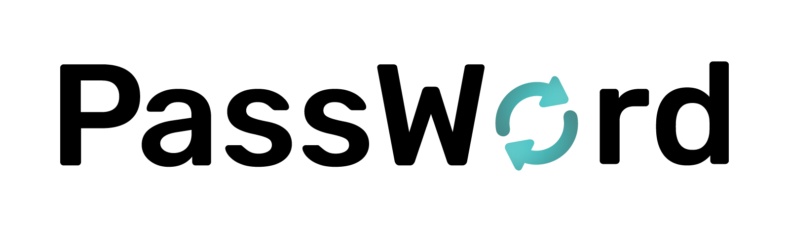
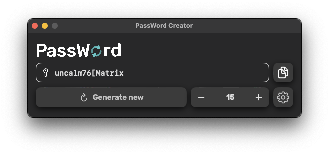

In macOS 10.15 Apple removed the abilty to generate memorable passwords in the Keychain Access application. This little project aims to bringing the functionality back.



## 📙 Supported languages 
PassWord has been localized into the following languages and can generate passwords using each of them.
- **English**: ```Louses59(Voting``` 
- **German**: ```Herrje86}Seiten```

## 💻 System requirements
- macOS 10.15 (Catalina) or higher

## ⬇️ Installation
- Download the latest compiled release from the releases tab
- Compile from source

## 🍩 Acknowledgements
- [German wordlist](https://gist.github.com/MarvinJWendt/2f4f4154b8ae218600eb091a5706b5f4) by MarvinJWendt
- [English wordlist](https://github.com/dwyl/english-words/blob/master/words.txt) by dwyl

## 📑 License
This project is licensed under the MIT License. See [License](License.md) for more information.